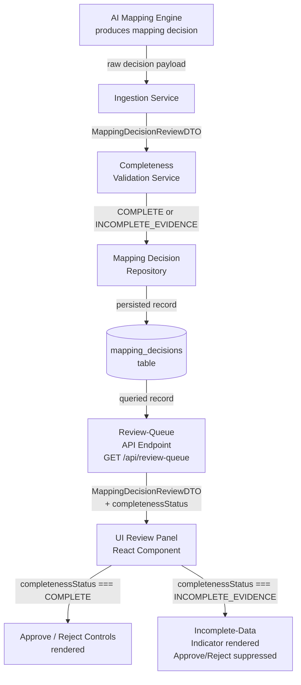
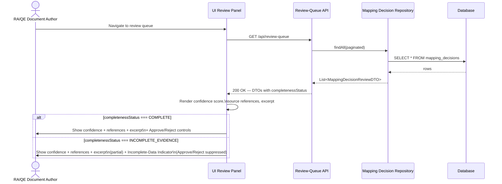

# Architecture: TAB-6 — AI Mapping Decision Review with Confidence Score, Source Reference & Excerpt

**Epic:** TAB-6  
**System Requirement:** SYS-001  
**Document status:** Draft  
**Last updated:** 2026-06-18  

---

## 1. Overview

This document describes the software architecture for the TAB-6 epic: *Display AI Mapping Decisions with Confidence Score, Source Reference, and Source Excerpt Before Human Review*.

**System Requirement SYS-001** mandates that every AI-proposed mapping decision presented for human review must be accompanied by:
- A numerical confidence score in the range 0.00–1.00
- At least one cited source reference
- The verbatim source content excerpt

All three elements must be simultaneously visible before the approve/reject interaction is surfaced to the RA/QE Document Author. If any element is absent, the approve/reject control is suppressed and an explicit incomplete-data indicator is shown.

This capability is part of the DHF Document Migration and AI Mapping Review workflow.

---

## 2. Goals & Non-Goals

### Goals
- Define a stable, validated data contract (`MappingDecisionReviewDTO`) shared across all layers.
- Implement a completeness validation service that classifies decisions as `COMPLETE` or `INCOMPLETE_EVIDENCE`.
- Persist mapping decisions with their completeness status in the data layer.
- Expose a review-queue API endpoint returning validated mapping decisions.
- Render confidence score, source references, and source excerpt simultaneously on the review panel.
- Suppress approve/reject controls when evidence is incomplete; show an explicit indicator.
- Verify that UI-displayed confidence scores are identical to data-layer values (≥10 decisions).

### Non-Goals
- AI model training or confidence score generation (upstream concern).
- Approve/reject action handling and downstream workflow (separate epic).
- Authentication and authorization implementation (existing platform concern).
- Audit logging of review decisions (out of scope for this epic).

---

## 3. Architecture Diagram

### 3.1 Data Flow — Component Overview



### 3.2 Sequence — Review Panel Load



---

## 4. Component Design

### 4.1 `MappingDecisionReviewDTO`

The canonical data contract shared by all layers. Any change to this contract requires cross-team review.

#### Fields

| Field | Type | Required | Constraints | Description |
|---|---|---|---|---|
| `mappingId` | `string` (UUID) | Yes | Non-null, non-empty | Unique identifier for the mapping decision |
| `sourceDocumentId` | `string` | Yes | Non-null | Identifier of the source DHF document |
| `targetRequirementId` | `string` | Yes | Non-null | Identifier of the target requirement being mapped |
| `confidenceScore` | `number` (float) | Yes | 0.00 ≤ value ≤ 1.00, 2 decimal precision | AI-assigned confidence score |
| `sourceReferences` | `SourceReference[]` | Yes | Length ≥ 1 | Cited source references supporting the mapping |
| `sourceExcerpt` | `string` | Yes | Non-null, non-empty | Verbatim source content excerpt |
| `completenessStatus` | `enum` | Yes | `COMPLETE` \| `INCOMPLETE_EVIDENCE` | Computed by validation service at ingestion time |
| `incompleteReasons` | `string[]` | Conditional | Non-null when status is `INCOMPLETE_EVIDENCE`; empty array when `COMPLETE` | Human-readable list of missing/invalid fields |

#### `SourceReference` Sub-Object

| Field | Type | Required | Description |
|---|---|---|---|
| `referenceId` | `string` | Yes | Unique ID of the reference |
| `documentTitle` | `string` | Yes | Title of the cited source document |
| `sectionIdentifier` | `string` | Yes | Section or clause identifier within the document |
| `pageOrLocation` | `string` | No | Page number or location hint (optional) |

#### Validation Rules
1. `confidenceScore` must be a finite number, not NaN, in range [0.00, 1.00].
2. `sourceReferences` array must contain at least one element; each element must have non-empty `referenceId`, `documentTitle`, and `sectionIdentifier`.
3. `sourceExcerpt` must be a non-null, non-empty, non-whitespace-only string.
4. `completenessStatus` is computed — never accepted from the caller.

---

### 4.2 Completeness Validation Service

**TAB-9**

#### Responsibility
Evaluate a `MappingDecisionReviewDTO` instance (before persistence) and return a validated version with `completenessStatus` and `incompleteReasons` populated.

#### Logic

```
function validate(dto: MappingDecisionReviewDTO): MappingDecisionReviewDTO
  reasons = []

  if dto.confidenceScore is null or undefined:
    reasons.push("MISSING_CONFIDENCE_SCORE")
  else if dto.confidenceScore < 0.00 or dto.confidenceScore > 1.00:
    reasons.push("CONFIDENCE_SCORE_OUT_OF_RANGE")

  if dto.sourceReferences is null or length < 1:
    reasons.push("MISSING_SOURCE_REFERENCES")
  else for each ref in dto.sourceReferences:
    if ref.referenceId, ref.documentTitle, or ref.sectionIdentifier is empty:
      reasons.push("INCOMPLETE_SOURCE_REFERENCE:" + ref.referenceId)

  if dto.sourceExcerpt is null or blank:
    reasons.push("MISSING_SOURCE_EXCERPT")

  dto.completenessStatus = (reasons.length === 0) ? COMPLETE : INCOMPLETE_EVIDENCE
  dto.incompleteReasons = reasons
  return dto
```

#### INCOMPLETE_EVIDENCE Status Handling
- Records with `INCOMPLETE_EVIDENCE` are persisted (not rejected) to allow the queue to surface them with the indicator.
- The service does not define the re-validation trigger. Re-validation occurs when the upstream AI engine re-submits the decision; the ingestion service re-runs the validation and updates the stored record.

---

### 4.3 Review-Queue API Endpoint

**TAB-11**

#### Endpoints

| Method | Path | Description |
|---|---|---|
| `GET` | `/api/review-queue` | Returns a paginated list of mapping decisions |
| `GET` | `/api/review-queue/{mappingId}` | Returns a single mapping decision by ID |

#### Request — `GET /api/review-queue`

Query parameters:

| Parameter | Type | Default | Description |
|---|---|---|---|
| `page` | integer | 0 | Zero-based page index |
| `size` | integer | 20 | Page size (max 100) |
| `status` | string | (all) | Optional filter: `COMPLETE` or `INCOMPLETE_EVIDENCE` |

#### Response — 200 OK

```json
{
  "page": 0,
  "size": 20,
  "totalElements": 42,
  "items": [
    {
      "mappingId": "uuid-...",
      "sourceDocumentId": "doc-001",
      "targetRequirementId": "req-042",
      "confidenceScore": 0.87,
      "sourceReferences": [
        {
          "referenceId": "ref-001",
          "documentTitle": "DHF Design Specification v2.1",
          "sectionIdentifier": "§3.4.2",
          "pageOrLocation": "p. 18"
        }
      ],
      "sourceExcerpt": "The device shall maintain a core temperature...",
      "completenessStatus": "COMPLETE",
      "incompleteReasons": []
    }
  ]
}
```

#### Error Responses

| Status | Condition |
|---|---|
| 400 | Invalid query parameters |
| 404 | `mappingId` not found |
| 500 | Internal server error |

#### Serialization Contract
- `confidenceScore` is serialized as a JSON number with exactly 2 decimal places at the API boundary to prevent floating-point drift in the UI (AC-6).

---

### 4.4 Data Persistence Layer

**TAB-12**

#### Table: `mapping_decisions`

| Column | Type | Nullable | Notes |
|---|---|---|---|
| `mapping_id` | UUID | No | Primary key |
| `source_document_id` | VARCHAR(255) | No | |
| `target_requirement_id` | VARCHAR(255) | No | |
| `confidence_score` | DECIMAL(4,2) | Yes | Null if AI did not provide a score |
| `source_references` | JSONB / TEXT (JSON) | Yes | Serialized `SourceReference[]` |
| `source_excerpt` | TEXT | Yes | Verbatim excerpt |
| `completeness_status` | VARCHAR(32) | No | `COMPLETE` or `INCOMPLETE_EVIDENCE` |
| `incomplete_reasons` | TEXT[] / JSON | Yes | Array of reason codes |
| `created_at` | TIMESTAMP | No | Set at ingestion |
| `updated_at` | TIMESTAMP | No | Updated on re-validation |

#### Record Lifecycle

```
[AI Engine] → Ingestion Service
  → CompletenessValidationService.validate()
  → INSERT into mapping_decisions (status = COMPLETE or INCOMPLETE_EVIDENCE)
  
[AI Engine re-submission] → Ingestion Service
  → CompletenessValidationService.validate()
  → UPDATE mapping_decisions SET completeness_status, incomplete_reasons, updated_at WHERE mapping_id = ?
```

#### Index Strategy
- Primary key on `mapping_id`
- Index on `completeness_status` for filtered queue queries

---

### 4.5 UI Review Panel

**TAB-13, TAB-10**

#### Component: `MappingReviewPanel`

Receives a single `MappingDecisionReviewDTO` as a prop (loaded from the review-queue API).

#### Rendering Logic

```
render(dto):
  always render:
    - ConfidenceScoreDisplay  ← dto.confidenceScore (formatted to 2 decimal places)
    - SourceReferenceList     ← dto.sourceReferences[]
    - SourceExcerptBlock      ← dto.sourceExcerpt (verbatim, monospace or block-quote)
  
  if dto.completenessStatus === COMPLETE:
    render ApproveRejectControls
  
  if dto.completenessStatus === INCOMPLETE_EVIDENCE:
    render IncompleteDataIndicator (banner/badge listing dto.incompleteReasons)
    do NOT render ApproveRejectControls
```

#### Sub-Components

| Component | Description |
|---|---|
| `ConfidenceScoreDisplay` | Renders `confidenceScore` as a formatted number (e.g., `0.87`). No rounding — value is pre-normalized at API boundary. |
| `SourceReferenceList` | Renders an ordered list of `SourceReference` items (title, section, optional page). |
| `SourceExcerptBlock` | Renders `sourceExcerpt` verbatim in a read-only block-quote or code block — no truncation. |
| `ApproveRejectControls` | Rendered only when `completenessStatus === COMPLETE`. |
| `IncompleteDataIndicator` | Rendered only when `completenessStatus === INCOMPLETE_EVIDENCE`. Displays a visually distinct banner listing `incompleteReasons`. The approve/reject controls are absent from the DOM (not merely hidden). |

#### Layout Constraint (AC-4)
All three evidence elements (confidence score, source references, source excerpt) must be rendered in the same scrollable panel — no tabs, accordion collapse, or modal navigation required to see any of them.

---

## 5. Data Flow (End-to-End Narrative)

1. **AI Mapping Engine** produces a raw mapping decision payload containing a proposed link between a source DHF document and a target requirement, along with a confidence score, source references, and a source excerpt.

2. **Ingestion Service** receives the payload and constructs a `MappingDecisionReviewDTO` from the raw fields.

3. **Completeness Validation Service** (TAB-9) inspects the DTO for the three required evidence elements. It sets `completenessStatus` to `COMPLETE` if all three are valid, or `INCOMPLETE_EVIDENCE` with a populated `incompleteReasons` list otherwise.

4. **Mapping Decision Repository** (TAB-12) persists the validated DTO to the `mapping_decisions` table, including the computed `completenessStatus`. The record is stored regardless of status.

5. **Review-Queue API** (TAB-11) serves `GET /api/review-queue`, querying the repository and returning paginated `MappingDecisionReviewDTO` objects including `completenessStatus` and `incompleteReasons`. The `confidenceScore` is serialized to exactly 2 decimal places in the JSON response.

6. **UI Review Panel** (TAB-13, TAB-10) loads the queue, renders each decision's confidence score, source references, and source excerpt simultaneously. For `COMPLETE` decisions, approve/reject controls are rendered. For `INCOMPLETE_EVIDENCE` decisions, the controls are suppressed and the `IncompleteDataIndicator` is rendered instead.

7. **Fidelity Verification** (TAB-14) seeds known confidence scores into the data layer, triggers the full pipeline, and asserts that the value displayed in the UI matches the seeded value for ≥10 decisions.

---

## 6. Acceptance Criteria Traceability

| AC | Description | Satisfying Component(s) | Story |
|---|---|---|---|
| AC-1 | Confidence score (0.00–1.00) displayed for every mapping decision | `ConfidenceScoreDisplay`, `MappingDecisionReviewDTO.confidenceScore`, Review-Queue API | TAB-8, TAB-11, TAB-13 |
| AC-2 | At least one cited source reference displayed before approve/reject is accessible | `SourceReferenceList`, Completeness Validation Service (INCOMPLETE_EVIDENCE blocks approve/reject) | TAB-8, TAB-9, TAB-10, TAB-13 |
| AC-3 | Source content excerpt displayed verbatim before approve/reject is accessible | `SourceExcerptBlock`, Completeness Validation Service | TAB-8, TAB-9, TAB-10, TAB-13 |
| AC-4 | All three elements simultaneously visible — no navigation required | `MappingReviewPanel` layout constraint (single scrollable panel) | TAB-13 |
| AC-5 | If any element is missing: approve/reject suppressed and incomplete-data indicator shown | `IncompleteDataIndicator`, `ApproveRejectControls` conditional render, `completenessStatus` | TAB-9, TAB-10, TAB-12 |
| AC-6 | UI confidence score identical to data-layer value (≥10 decisions verified) | API serialization (2 d.p.), `ConfidenceScoreDisplay` (no client-side rounding), E2E test suite | TAB-11, TAB-13, TAB-14 |

---

## 7. Story Sequencing & Dependencies

| Story | Phase | Depends On | Description | Definition of Done Notes |
|---|---|---|---|---|
| TAB-7 | 0 — Foundation | — | Feature story / CI slot | Feature branch created; CI pipeline slot confirmed |
| TAB-8 | 1 — Data Contract | TAB-7 | Define `MappingDecisionReviewDTO` | DTO published as shared module; unit tests for field contracts pass |
| TAB-9 | 2 — Backend Services | TAB-8 | Completeness validation service | All incomplete-path unit tests pass; COMPLETE golden-path test passes |
| TAB-12 | 2 — Backend Services | TAB-8, TAB-9 | Persist INCOMPLETE_EVIDENCE records | Schema migration applied; integration tests for both statuses pass |
| TAB-11 | 3 — API Layer | TAB-8, TAB-9, TAB-12 | Review-queue API endpoint | OpenAPI spec published; contract tests pass; serialization of `confidenceScore` to 2 d.p. verified |
| TAB-10 | 4 — UI | TAB-11 | Suppress approve/reject; show indicator | Approve/reject absent from DOM for INCOMPLETE_EVIDENCE; indicator present; controls shown for COMPLETE |
| TAB-13 | 4 — UI | TAB-11 | Render confidence, references, excerpt | All three elements in DOM simultaneously; no navigation required to view any element |
| TAB-14 | 5 — Verification | TAB-8, TAB-9, TAB-11, TAB-12, TAB-13 | UI confidence score fidelity | E2E tests for ≥10 decisions pass in CI on staging environment |

*TAB-9 and TAB-12 can be developed in parallel after TAB-8 is merged.*  
*TAB-10 and TAB-13 can be developed in parallel after TAB-11 is merged.*

---

## 8. Risks & Mitigations

| Risk | Likelihood | Impact | Mitigation |
|---|---|---|---|
| DTO contract instability after Phase 1 | Medium | High — ripples to all layers | Lock DTO behind versioned interface; require cross-team approval for any field change post-merge |
| Floating-point drift in confidence score (AC-6) | Medium | High — direct AC failure | Normalize `confidenceScore` to 2 decimal places at API serialization boundary (not in UI); do not allow UI to perform any arithmetic on the value |
| `sourceReferences` schema ambiguity at ingestion | Medium | Medium — incomplete validation | Fully define `SourceReference` sub-object fields in TAB-8 alongside the parent DTO; include sub-object in contract tests |
| INCOMPLETE_EVIDENCE records never transitioning to COMPLETE | Low | Medium — stuck review queue | Document re-validation trigger in TAB-12 DoD; add a queue-health metric for long-lived INCOMPLETE_EVIDENCE records |
| UI mocking diverging from real API shape | Medium | High — TAB-14 failures | Generate UI API client from the OpenAPI spec produced in TAB-11; do not hand-write mocks |
| Approve/reject control hidden vs. absent from DOM | Low | Medium — AC-5 ambiguity | Specify "absent from DOM" (not `display:none`) in TAB-10 acceptance criteria; assert with DOM queries in tests |
| Source excerpt truncation in UI | Low | Medium — AC-3 violation | `SourceExcerptBlock` must render verbatim without truncation; include a long-excerpt rendering test in TAB-13 |
